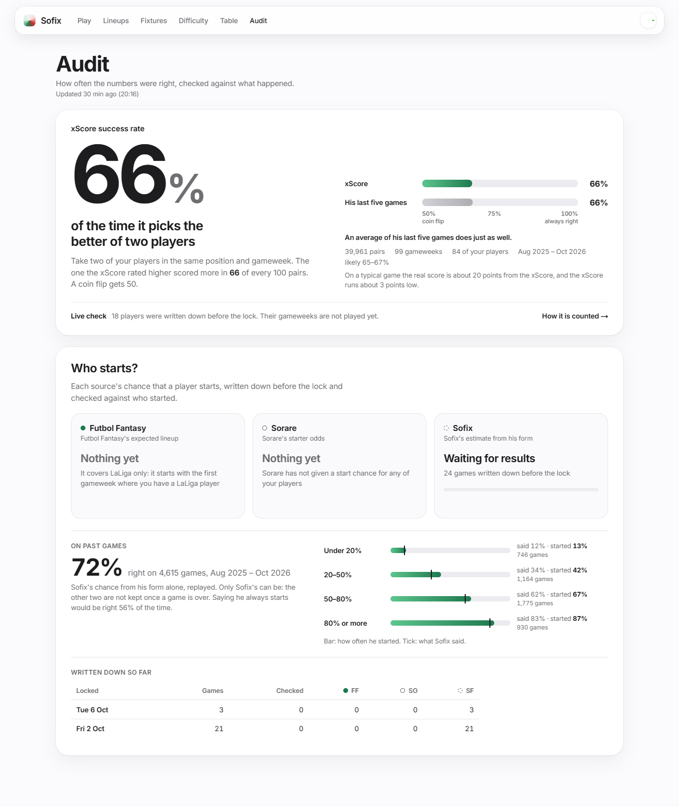

# Sofix illustrated user manual

**Edition:** 2026-09-28 · **Audience:** the Sofix owner · **Scope:** web app, PWA, Control Center and Chrome extension.

The screenshots in this manual use the repository's deterministic demo fixture, and the extension shots use a
recorded 24 September review payload. They demonstrate layout and meaning—not live recommendations, balances,
prices or standings. Live pages always show their own sync/freshness state.

## 1. First use

Open Sofix in Chrome or Edge. The app is private and protected by the deployment login. Use the header to move
between Play, Lineups, Fixtures, Difficulty, Table, Audit, Cards and Players. The Sofix wordmark returns home.

The week control on the right is app-wide:

- left/right arrows move one available week;
- the centre opens the week picker;
- the target icon returns to the current week;
- the round status dot distinguishes LaLiga from Sorare-only weeks.

The sun/moon button at the top right of the bar switches between the light and the dark theme. The choice is kept in
this browser; until one is made, Sofix follows the system's light or dark setting.

A week has one name on every page, in the bar, in the Play title and on Lineups and Home, because the two leagues count their
weeks differently (LaLiga's round 8 is Sorare's GW21): **LaLiga round 8 · Sorare GW21**; before Sorare opens the week
**LaLiga round 9 · Sorare not open**; an international break has no LaLiga round, **Sorare GW19 · national teams**.

In the picker each week's chip says how many of your cards play ("88 playable"), and the column on its right always says what its number
is: "48% reward chance · 3 plans", "250 essence · our plan's replay", "early plan" ("· expected" when its competitions are), "2 cards play".

How fresh something is reads the same everywhere (Home, Play, Lineups, Control, the status pill, the sorare.com overlay): how long
ago and the time it was made in Madrid, **9 h ago (03:33)**; once it is over a day old the day is added, **2 days ago (Tue 03:33)**.

Each page lists the weeks it can show: the LaLiga pages list LaLiga rounds; **Play** lists every Sorare gameweek
once (one that covers a weekend and a midweek round is one row), plus every LaLiga week still to come that Sorare
hasn't opened yet, marked **Sorare opens later**, or **early plan** when the job has planned it. A week with nothing to
show says so instead of showing another gameweek.

The selected week lives in the URL (`?gw=` for LaLiga-oriented pages and the shared week mapping behind `?w=` for
the combined calendar), so a bookmark preserves the view. LaLiga and Sorare gameweek numbers are separate systems;
the date range is the reliable common reference.

### Install as an app

Open **Control** from the circular status control, then use **Get the app**:

1. Desktop Chrome/Edge: choose the install icon at the end of the address bar.
2. Phone: scan the QR code, open the private site, then choose **Add to Home Screen**.
3. Keep the same private deployment login. Installation does not create another account or background service.

The PWA is a windowed shortcut to the same cached app. It is not an offline database; stale/failed source states
remain visible rather than being invented locally.

## 2. Recap (home) — this gameweek at a glance

The Recap is about the week in the top bar (since 5 Oct 2026; design canvas board 1). From the top:

- **Header**: the Sorare gameweek, its LaLiga round and days, when it locks ("Locks Fri 16:00, in 4 days") and **Open the plan**.
- **Best cards**: your ten best cards of the week by xScore, all positions together, each with its xScore in a hexagon of Sorare's
  colour, his first game and his chance to start (whose number it is on hover).
- **Your season**: choose a season to see Limited essence, cash, card rewards and distinct GWs with entered lineups.
  **Week by week** shows rewarded GWs only; expand one to see its actual essence-winning lineups and captains.
  Zero-reward GWs still count as played. Open Home in Chrome with a signed-in Sorare tab to save missing finished
  weeks; failed reads can be retried. Saved lineups and rewards also work on your phone without the extension.
- **This round**: every match as two rows, home over away, under labelled columns: chance to win (a chip in Sorare's colours), expected
  goals and clean-sheet chance; draw and both-score beside the pair. The favourite is in bold; a played match shows its score.
- **Table after round N**: the table once the round is played as expected: points now, points after and places gained or lost.
- **Your lineups**: the plan's three likeliest-to-pay lineups with their cards (xScore under each, captain marked), team score and its
  range, the score it needs for a reward, a ring with the chance of cash or essence, the chance of other rewards and what its first level pays, whole;
  the others as chips. Every lineup is on the Sorare view.
- **Missions**: today's open missions and the three cards of yours that fit each best, with the chance (the Missions page's numbers).
- **News this week**: your players hurt or banned in the last seven days and those cleared to play after a knock, in Futbol Fantasy's
  words in English with the date and their chance to start. A long-standing injury is not news; the Lineups page keeps every note.

The header also says whose Sorare account it reads and when it was synced. **Your lineups** opens with what you entered on
Sorare (read through the extension), then the plan's best lineups. **Team news** sits beside **News this week**: how your
plan's players look for the round, who might not start and what moved since yesterday, or why Futbol Fantasy has said
nothing yet. The old Sorare row is gone from the home: the plan and the week just played are on the Sorare page, and the
collection (with its "No Rare goalkeeper" warning) is in the Gallery.

Every player card grows a little when you point at it (a spring, a shadow and a light sweep). In-season cards and
competitions carry a star, Classic ones a clock.

Each colour of a number is Sorare's own score band for it: up to 20 red, 21 to 35 orange, 36 to 50 yellow, 51 to 60 lime, 61 to 75
green, 76 and above cyan.

When a selected Sorare week has no LaLiga round, Home replaces the LaLiga strip/tiles with **No LaLiga this week**
and lists the owner's actual fixtures, chance to play and xScore. It does not silently show the next league round.

## 3. Fixtures

The LaLiga view (This week → LaLiga) opens on the round as a scoreboard: each match on two rows with each side's
chance to win, expected goals and clean-sheet chance, plus the draw and both-score chances; beside it, the table
after the round. The plain list of fixtures and results by day follows.

Fixtures is the plain schedule for the selected LaLiga GW. Each row contains kickoff in `Europe/Madrid`, home/away
clubs, status or score, and the pre-match outlook. “Date TBC” means football-data.org has not assigned a kickoff.

For a future match, use the probability/price context as a forecast, not as a certainty. For a finished match, the
stored forecast stays attached so the result can be reviewed honestly. Changing the header week changes this list,
the difficulty overview and the current-table cutoff together.

## 4. Difficulty

Season → Fixtures (`/season`) lists every round of the season, fixtures and results by day; a strip of round numbers
jumps to any round, and the page opens on the round in play. Difficulty colours use Sorare's score bands: cyan for the
easiest games, then green, yellow, orange and red for the hardest.

Difficulty is the main football-planning page. It contains:

1. **Kindest/toughest run** — per-game comparison for the chosen horizon.
2. **This GW** — the selected matches.
3. **Who to pick** — forwards by expected goals, defenders/keepers by clean-sheet chance, midfielders by a 65/35
   attack/defence blend.
4. **All-club ranking beside the current table** — row-aligned, with xPts as a number rather than a decorative bar.
5. **Full fixture grid** and the selected GW's fixture list.

### Horizon

**Next** shows the selected gameweek as match cards. **Next 3/5/8** aggregates future games from that week. Finished
fixtures remain visible for review but do not inflate future totals.

### Six lenses

| Lens | Tile answers | Ranking total answers |
|---|---|---|
| Overall | How likely is the club to get a result? | Expected points across future games |
| Attack | How many goals should it score? | Expected goals across future games |
| Defence | How likely is a clean sheet? | Expected clean sheets across future games |
| Record | How has this club historically done at this model price? | Average actual points in comparable price bands |
| Vs odds | How has it historically done at this bookmaker price? | Average actual points in comparable market bands |
| Odds | What is the fair bookmaker win chance? | Market expected points per priced future game |

Record and Vs odds are descriptive checks, not hidden inputs to the forecast. They use five seasons, require at least
five club matches and shrink toward an eight-game prior. Odds totals are averaged per priced future match so a club
with an extra priced game is not automatically favoured.

### Colours and labels

Lower difficulty is kinder. The five spoken labels are **Very favourite**, **Favourite**, **Even**, **Underdog** and
**Big underdog**. Tiles show colour, opponent and venue; bucket numbers deliberately stay in tooltips/screen-reader
text. Buckets 4–5 also receive a visible ring. The top cutoff is stricter away than at home.

### Price menu

For multi-week Record/Vs odds cards, choose which price/result statistic appears: W/D/L, scoring/two-plus goals,
clean sheet or conceding two-plus. Fair odds are `1 / probability`. Market-derived scoring and clean-sheet numbers
are fitted from fair 1X2 plus totals prices; they are implied probabilities, not direct bookmaker markets.

## 5. Table

Season → Table switches between **Now** (played games), **After round N** (played points plus the expected points of
every game up to the end of the week's round) and **End of season** (the projection to the last round, with title, top
four and relegation chances); the address keeps the choice (`?t=after`, `?t=predicted`).

The left/current table stops after the selected LaLiga GW. Its ordering applies LaLiga head-to-head only after both
mutual matches have been played, then goal difference and goals scored. Early in a season, that can differ from a
site that provisionally uses goal difference for unresolved ties.

The predicted table combines played points with expected future points and seeded season simulations. Identical
input always produces identical title/Europe/relegation percentages. It is a model projection, not the official
table and not a live betting price. The preseason opening projection is fixed so later views do not rewrite what
Sofix believed before the season.

## 6. Team page

Open a club from a table, fixture or grid. The team page gathers its selected-week match, upcoming run, lens values,
results/form and table context. Use it when the grid's compact tile is not enough. The same global week and model
definitions apply; the page does not run a separate club model.

## 7. Play — Sorare planner

Play shows the latest published plan for the selected Sorare gameweek. It is built from the synced collection,
competition rules, pre-lock forecasts and reward cutoffs.

The hero counts down to the lock in large type ("2d 22h until the lock, Fri 9 Oct at 16:00"; after the games, the essence
won), with the plan's facts under it: chance of a reward, the most likely result, the chance of cash, of essence and of XP apart,
cards used. Beside it, "Your Sorare lineups" (what is actually entered) and Apply plan. Below, the plan tile holds the
**Sofix / Sorare** switch, the plan switch, where the cards go, and the lineups as rows: competition, its cards with each
one's xScore in Sorare's colours, the team score with its range and the score needed, and the reward chance as a dial; each
row opens its sheet. Lineups under 5% sit under **Long shots**; this opens immediately when they are the only available
lineups. A locked/live GW retains its recorded pre-lock plan, including on Home, rather than showing the next GW's plan.

**Sofix or Sorare (6 Oct 2026).** For the week being planned there are two sets of plans: **Sofix** builds them on Sofix's
xScore, **Sorare** on Sorare's own projections (game by game, read for that week's games). Both use the same cards,
competitions and chances of starting; only the expected score differs, so you can compare them, and the Audit scores both.
Until Sorare publishes its projections (about two days before the lock) the Sorare view says when they are due.

**Essence first.** Under the lineups, **Essence first** lists the essence the plans fill first: LaLiga, then Champion, then
All Star unless you change it (↑ ↓, then **Save and replan**, which starts a refresh; the plans follow it about six minutes
later). Sofix fills the lineups of your first essence first, then the second and the third; inside each, the lineup most
likely to be paid goes first. A lineup under 5% gets no priority. Plans are then ranked the same way: the best chance of
being paid by your first essence, then the second, the third, then of anything. While the gameweek is the one being
played, today's missions sit under the lineups with the cards that fit each (chance, opponent, kick-off and what he
did over his last 5); the full Missions page is one click away.

At the top, **Your Sorare lineups** shows what the signed-in owner actually put on Sorare for this exact GW. Entered
lineups and drafts are labelled separately and retain their Sorare competition and card list. This is not Sofix's
suggested plan: the extension reads the selected Sorare fixture directly, so the block also works for timeline weeks
that Sofix no longer retains as an optimized plan. A signed-in `sorare.com` tab must be open; otherwise the block says
which extension/session prerequisite is missing. Lineups from another GW are never carried into the selected one.

Once Sorare has scored a lineup, its row shows the **score** (large), then **where it ranked and what it was paid**
("Rank 1,204 · $2.50 · 250 essence", or "no reward paid" once it is ranked and nothing was), and each card carries its
own score with a **C** on the captain. Before the lock the row says "Locks in 1 d 3 h" instead of a 0, between the lock and the
first game it says "Not started", and once the games are on and it has no rank yet it says "Still scoring". This needs the
extension at version 0.2.2 or later (reload it in `chrome://extensions`); an older one still shows the lineups, without
their results. Essence counts Limited essence only, as the plans do.

Read each lineup from left to right:

- competition and lock state;
- cards/slots, captain and substitutes;
- each card's **xScore**, the same number as on Lineups and Players: his score if he starts, or if he comes on when he is
  under 40% to start, with whose number it is (SF Sofix, SO Sorare, L5 his last five); the team score below counts the
  chance of not playing;
- an expected range, not a guarantee;
- reward probability and the cutoff evidence behind it;
- what its first level pays and the score that reached it ("250 at 311+").

**A reward is all or nothing.** A lineup that reaches a level gets that level's reward whole; one that does not gets
nothing. Play never shows a share of a reward. A lineup's sheet lists every level under **Rewards**: the score that reached
it in the week the chances come from ("311+ · #301–1,500"), what it pays, and the chance of scoring at least that, so the
first level's chance is the lineup's reward chance. A Room lists its places instead. **XP** levels (500 to 1,000 XP for
LaLiga ranks 1,501 to 3,500, Room places 4 and 5) are listed and given their own chance, but XP never counts as being paid.
A Room's entry fee is shown as "300 to enter": it is a cost, never taken off a result, and a Room is only played when it wins
back more than its fee on average.

In a lineup's sheet, a card's name opens his match on **Lineups** (Futbol Fantasy's probable elevens and the chance of each player of his
side). A game Futbol Fantasy has no page for, such as a national-team game, has no link.

The planner enforces the published slots, caps, in-season minimum, club/card/player uniqueness, bonuses and substitute
rules. A substitute is kept only when its expected protection exceeds the bonus sacrificed by using it. It repeats a
seeded, slightly randomized whole-gameweek search and returns up to five plans whose card sets are materially different.
Your essence order comes first, then **the plan most likely to be paid anything** (cash, essence or a card), whatever the
size of the reward (your choice, 5 Oct 2026); what a plan pays only breaks a tie. The chances come from one simulation of the
whole plan, so two lineups holding the same players or the same game rise and fall together instead of being counted as if
apart. A plan's **most likely result** is its likeliest winnings for the week, with its chance; it is often nothing even when
some reward is likely, because the ways of winning are split over many amounts. Cash and essence stay separate.
**Also open** gives each competition left out its reward chance and its entry fee.

### xScore

A card's xScore is his score if he starts (or comes on, under 40% to start). In the Sofix plan it is Sofix's own number where
the game model can make one (every game of his week a LaLiga game it knows), else Sorare's projection for that game, else his
last five games; the card's mark says which. The team score is the expected total: each card's score times its chance of
playing, with the bonuses. Both numbers, Sorare's and Sofix's, are written down for every LaLiga player before each lock
(`score_record:<week>`), so the Audit can say who was closer.

### Predicted vs actual

After a gameweek, Play compares recorded pre-lock player/lineup ranges with actual submitted-lineup scores. A replay
is meaningful only when the forecast was stored before lock. Actuals do not retroactively change the old forecast.

Choose **After the games** on a played week: each plan shows what it won against what it was expected to win (the
expected numbers are a replay, built from form as it stood before the lock, not the Sorare-informed plan you saw then).
The last tab, **In hindsight**, is the best way to have spread your cards over that week's competitions knowing every
score: the most Sofix found it could have won, against the scores that really paid that week. It is the best result of a
search, not a proven maximum, so one of your own lineups can occasionally beat it. It uses the cards you own today, leaves
Rooms out (a Room depends on nine other managers' lineups), and never names an expected number, because there is none.

A LaLiga round Sorare has not opened yet (LaLiga GW36 in May, say) opens as an **early plan**: a plain note says so,
and it is built from the LaLiga calendar for your cards' games, their recent form and the LaLiga competitions Sorare is
going to open, with one plan and no Apply button. Those competitions are copied from the latest finished gameweek of the same
kind (five or more LaLiga games, or fewer; the week and its rewards are named), and each lineup says **Expected** until Sorare
lists the real ones. It is a first guess: your cards as they are today, no start odds, and competitions Sorare may change. It moves each refresh, and Sorare's own numbers replace it when the week opens. The one
round that already has a lineup on Futbol Fantasy (each club's next LaLiga game, round 8 in the October break) uses
Futbol Fantasy's chance to start instead of Sofix's guess, with its **FF** mark, and a player it has out or suspended is in
no lineup. Rounds after it have no Futbol Fantasy yet and keep the guess. The early-plan note also says that, built on form,
later weeks look alike until Sorare opens them.

A gameweek Sorare **has** opened can still lack its LaLiga competitions for a while. Then the same expected competitions are added
beside the official ones: the plan shares your cards across both, each expected lineup says "Expected · Sorare has not opened it
yet", a banner above the plan says which finished week they were copied from, and Apply leaves them out (Check, Draft and Enter only
work for competitions Sorare lists). The Home says how many lineups are expected and the week picker adds "expected" beside the plan.
The day Sorare lists the real competitions, the next refresh shows only those.

Every gameweek is **kept** once its scores are final (a day after it ends, and once everything it was built from could
be read from Sorare) and stays in the picker with its replay and hindsight, however old. A week played before Sofix started
keeping them is marked **not recorded**; it still opens, to the lineups you entered and what they won, read from Sorare.

A week Sofix holds no plan for says why, and still shows your lineups for it: one being played is locked, so there is
nothing left to plan; one further off than the next three Sorare gameweeks gets its plan once it is one of them.

## 7a. Lineups — who starts

Futbol Fantasy's probable elevens for every match it has published (FF covers each team's next game only, so the page is not
tied to the week in the top bar). One timeline holds the round's matches: a column for each day (Fri 9, Sat 10…), each kickoff time written once on a rail, and a match as
its two crests, home side first, under its time. Two games played together share one time. The open match is the black pair and its time
is darker; hover a pair for the club names. The page opens on the next match. On a phone the timeline scrolls sideways and keeps the open
match in the middle. Competition and round tabs appear only when the page holds more than one. Picking a match, a round or a
competition changes the page at once, from what it already holds (all the round's matches arrive with it): no reload, no wait, and
the address still says `?m=<match>` so the match can be bookmarked or sent, and Back returns to the one before. A click with
Ctrl or Cmd opens the match in a new tab as a link does.

The header is centred: "LaLiga round 8 · Fri 9 – Mon 12 Oct" (the days are the first and last kickoff, Madrid time), the question "Who starts
this round?", then a chip saying how fresh Futbol Fantasy's reading is. Hover or focus a match on the timeline for its saved bookmaker
chances, Sofix forecast and lineup formations; unavailable bookmaker data is labelled as such. Under the timeline, "Futbol Fantasy · kickoffs in Madrid time"; the Fixtures list says
"Madrid time" beside its match count for the same reason. Arriving with a week that FF does not cover (a past round, a later one, or a national-team week) adds one line:
"Futbol Fantasy only has each club's next LaLiga game: round 8. GW19 is national-team games." A match address that is no longer on
FF says so above the next match.

- **The pitch.** Each team's eleven as cards in rows, attack at the top, with the formation beside the team name; the two teams sit close,
  with no empty band between them. **Every player is drawn as his real Sorare card**: the card you own for yours (with a blue outline),
  and for everyone else a real Limited card of his from Sorare's public listing for this season, so the page looks the same for all
  22. While a card's picture is on its way it shows his name and position on a quiet skeleton, then the picture alone; a player Sorare
  has no card for (a club outside LaLiga, a new signing) keeps FF's photo or a silhouette. A club is its real crest, with its shield in
  the club's colour underneath until the crest arrives. The badge under a card is his chance of starting from the selected source. A round mark at a card's corner is an injury, a doubt or a
  ban; a **blue chip with two letters** ("KE", "ES") is a call-up to that country's national team (hover for the country's name). A call-up is only shown
  once his club has named its match squad on FF; until then the team carries "Squad list not out" and no call-up mark, so the
  page never says both. Names and positions on a card are 11 px or more on a desktop and 10 px on a phone (a long surname ends in an
  ellipsis; hover for the whole name); the card's colour says its rarity, and the hover says it in words.
- **Sources and your players.** Above the pitches, switch between **Futbol Fantasy**, **Sorare** and **Sofix** to see each source's
  chance of starting this match. Futbol Fantasy is selected first. With **Sorare** or **Sofix** picked, that source's eleven is drawn in
  Futbol Fantasy's formation: in each line a bench player with a higher chance takes the slot of the lowest starter, who then stands
  first under it. Futbol Fantasy's news decides who can: a player it has out (injured) or suspended never comes in, a doubt can and
  keeps his mark; a player with no number keeps Futbol Fantasy's place, and a tie keeps its starter. Sofix's chance counts a player's
  last five LaLiga games only (cup and European games are often rotated), is 0% after a red card in his last LaLiga game (a second
  yellow counts; read from Sorare by the scheduled refresh, which has the API key), and is a dash until any LaLiga game of his has
  been read. A dash means that source has no
  estimate for this player and match. Sofix also restores the exact match's captured forecast after the planner moves to
  the next GW. With extension 0.3.12+, Sorare's chance comes from the native responses its own pages receive:
  its custom GraphQL queries can return null even while its page displays a percentage. The extension combines readings
  from up to eight open Sorare tabs, by exact player and game, and keeps them in page memory for 15 minutes.
  **Open match on Sorare** loads a match not yet read; returning to Sofix reads again automatically.
  **Read from Sorare** also retries manually. Only players Sorare actually returned have a value; it does not fetch a
  whole GW automatically. Missing values remain dashes and genuine 0% stays 0%.
  A different match's number is never substituted. FF percentages link to its match
  page. **Only my players** dims everyone else on the pitch and in the injury lists. Both choices stay selected when you pick another
  match. Your players on the pitch, among the alternatives and in the injury list link to their card on **My cards**.
- **Who could come in for whom.** Under each starter's own card, the names of the alternatives Futbol Fantasy puts in his slot (the order it gives them), with their
  chance ("DÍAZ 40%" under Toni Martínez, "ALEÑÁ 40%" under Denis Suárez), the way its own pitch draws it. One player can stand under several
  starters (Lookman under both Lee and Grimaldo). Bench players it names under nobody are listed under the pitch as "Also on the bench".
  A reading from before the slots were read (before 2 Oct) places the alternatives under each line instead. A player is written the same short way
  on his card and on a chip (his surname, with an initial where two of a side share it), and his full name shows on hover. The % badge
  sits under a card, never over the name Sorare prints on your own cards. A player FF has not
  placed yet is listed apart as "Others in the squad"; alternatives at 5% or less, and anyone out or suspended, fold into one "+3 more" under the pitch (open it for their names and
  chances; the injury list below says why). Your own players never fold. In that list the knocks a player plays despite fold into "4 more fit
  to play".
- **Injuries and bans** are icons with FF's words in English: the diagnosis ("ACL tear", "Hamstring injury", "Training
  apart"), "since 12 Sep", and the note ("Doubt for round 8", "Available for round 8", "Out for round 8", "Out until January
  2027"). A return date that has already gone by reads "Was due back late September", never "Out until". A diagnosis the page
  cannot translate keeps FF's own words, in italics, with a tooltip saying so. **Your players FF does not list** are named under their club with why, and use Sorare's or Sofix's number.
- **The small information icon** at the top right of a match shows when FF was last read and when each team's lineup last
  changed on hover, focus or click; the arrow beside it opens the match on Futbol Fantasy.
- **States.** The pill under the title says how many teams are read and when; it says when FF could not be read (the last
  reading stands for 24 hours) or is over a day old (no longer used in plans); a match FF has taken off its site is simply dropped
and never counts as FF not being readable. A team FF has not published yet says so, a match
  that has kicked off is frozen, and "Date TBC" is matched by teams and round.

On a phone one team shows at a time, switched by the two names under the match.

**The mark beside a start chance** says whose number it is: a filled dot is FF, a ring is SO (Sorare's starter odds), a dashed
ring is SF (Sofix's estimate from his form). Play's cards say "50% starts" with the mark and, when FF says so, an icon for the
doubt; hover the mark for the name.

## 7b. Audit — how often the numbers were right

Audit has four views under the switch below the top bar (since 5 Oct): **xScore** (`/audit`, the charts below), **Who
starts** (`/audit/starts`, each source's record on who starts), **Written down** (`/audit/record`, every gameweek's
games written down before the lock and how many have been checked), **Rewards** (`/audit/rewards`, since 6 Oct) and **Missions**
(`/audit/missions`, since 6 Oct).

**Missions** answers "were Sofix's mission picks the right ones?". Every day Sofix writes down its picks for the **Decisive Picker**,
which Sorare runs every day, whether or not you loaded the day's missions; on a day you loaded them, the other missions too. It also
writes down every card of yours with a game that day, with its chance. A day after the games the refresh reads each game from Sorare
and marks who did what each mission asks. A mission day is then judged against what your cards could have done: the players who did
it are the achievers, and the best possible is the mission's picks or the number of achievers, whichever is fewer. The day is a
success when Sofix's picks hold that many achievers; a day when none of your cards did it is not counted. For example, with ten
players, picking 1, 2 and 3 when 1, 4 and 5 got a decisive action is a miss. The page leads with the share of mission days that were
the best possible (from 100 days; until then "Too few to tell yet"), then the achievers caught, your own picks scored the same way by
Sorare's verdict, the chance given against what happened, and each day with Sofix's picks (did it or not) and the cards that did it
but were not picked.

**Rewards** answers "how much essence should I have won, and how much did I?". Play shows a reward as all or nothing; over a
season the fair yardstick is the expected essence: each lineup's chance of each reward times that reward, added up week by week.
**Sofix's plans** totals that expected essence (and cash, kept apart) over every finished gameweek the job kept, against what the
plans' lineups really won, and gives the share won ("80% of the essence they expected was won") once 100 lineups are behind it;
until then it says "Too few to tell yet" and how many lineups it has. The plan counted is the one Sofix rebuilds for a finished
week from what was known before its lock. **You** adds up what your own entered lineups won on Sorare, read week by week through the
extension (a signed-in sorare.com tab is needed for new reads; final weeks are saved on the server, with older browser readings
as a fallback), and sets it against the plans'
expected essence over the same weeks. **Week by week** lists each kept week: expected, won by the plan, won by you. Sofix's
plan weeks before 25 Sep 2026 (GW17) were not kept; your own saved season can include earlier weeks Sorare returns.

**Your lineups against the plan at lock** is a separate comparison with the exact plans saved before each lock. It shows
their expected score, their score from saved games, and your saved score in the same competition. It uses the saved
captain, card bonuses and substitution rules; a double week uses the player's best score. Missing results say **Pending results**;
older plans without scoring rules say **Rules not saved**. **No entry** and **Not saved** distinguish an empty competition from
a week Sofix has not archived. The heading shows how many entered lineups and GWs are saved. Live Sorare reads are labelled
**not archived in Sofix yet**; final reads are saved after the GW settles. Rewards need that week's final cut-offs.

On **Cards**, each card shows the season rewards of the saved lineups it was in. These are whole-lineup rewards, not
individual earnings: do not add them across cards. No saved entry and temporarily unavailable storage are labelled separately.

The Audit page checks Sofix's numbers against what happened, as charts (since 4 Oct). The first block is a replay of two LaLiga seasons: every game
predicted from the weeks before it only (9,190 starts to 20 Sep).

- **Pick the better of two** leads. Take any two players of one position in the same gameweek; if Sofix gave one a higher xScore and he scored more, that is a hit. A small example pair
  shows it, and one row per position shows how often it hits **now** (the green dot) against **the old number** (the grey one), with the coin flip (50) marked: goalkeepers 54 against 50,
  defenders 59 against 54, midfielders 61 against 57, forwards 59 against 55.
- **Week by week** is the same figure for each of the 46 gameweeks (all positions together), against a coin flip.
- **How close** counts starts by how many points the score landed above or below the xScore; the four green bars in the middle are the starts within 7 points (31%); 63% are within 15.
- **Goalkeepers** and **Who starts** each plot what Sofix said against how often it happened: a dot on the dashed diagonal is honest.
- **Against Sorare's own number** sets the share of starts within 7 points of Sorare's projection (33%), of the old number (30%) and of the new one (31%), and the share of goalkeepers' starts inside the range (79%, the aim is 80).

These figures are written by hand from the local games export (`python -m app.jobs.audit_league --write`, into `frontend/lib/data/audit_league.json`), not by the refresh; the page says what they
cover. A figure with fewer than 100 starts behind it says "Too few to tell". Below them, **Who starts?** gives each of Futbol Fantasy, Sorare and Sofix a column of what has been written down
before real locks. It says how often the source was right (said 50% or more and he started, or less and he did not), how far its chances were from what happened (the error score: 0 is perfect,
0.25 is saying 50% every time), and how many of the players it put at 80% or more started. A source shows figures from 100 games. Under that it says "Too few to tell" and how far along it is, or
"Waiting for results" while the games are written down but not played, or "Nothing yet" with the reason: Sorare has not given a start chance for any recorded player, and Futbol Fantasy covers
LaLiga only. **Written down so far** lists each gameweek: the games written down before its lock, how many have been
checked since, and how many each source gave. (The old headline, 66% on your 84 players, is gone from the page: it measured the old formula on your players only; its method is still in
[How it is counted](xscore_success_rate.md).)

The live Audit checks every recorded player, including the LaLiga index and your players outside LaLiga, from saved games.
**Written before the lock** on xScore shows how many player gameweeks have been checked and how often the higher expected
score picked the better player. **Sorare vs Sofix** compares each saved number with the real score on starts; weekly figures
also say "Too few to tell" below 100 starts. A new week's results wait until a day after it ends; unread results stay waiting.

**Futbol Fantasy's eleven**, under Who starts, compares how many predicted starters started. Sorare and Sofix reorder the
same formation using their saved chances; **By gameweek and club** opens the counts for each. Every group needs 100 checked
starters before showing a percentage. Older readings without positions cannot produce an implied eleven. Until the first
reading is saved, it says "No predicted elevens kept yet". A failed source stops new readings and keeps the saved evidence.

**Match forecasts, checked**, below xScore, compares Sofix with bookmaker prices on the same finished LaLiga matches.
Forecasts update until kick-off and then stay fixed. Closing CSV prices come first, then the last available pre-match
price. Both RPS error scores wait for 100 paired results; lower is better. Missing prices or results stay pending.
The odds record keeps its own copy of prices and says **Odds up to** the newest saved match date. A source stopping
only stops new readings; saved prices remain available.
Older seasons back to 2016/17 are read once if the runner's cache did not already hold them.

The Audit page never writes to Sorare. It is rebuilt by each refresh; "The audit appears after the next refresh" means none has
written it yet.

## 8. Apply a lineup

Apply is the only Sofix flow that can change Sorare. It requires the configured extension, a signed-in Sorare tab,
the matching Sorare account and an unlocked/non-stale plan.

1. **Open Apply.** Sofix reads already-entered lineups and available slots; this is read-only.
2. **Check.** Sorare previews the appearances and returns its rule verdict, bonuses, multiplier, costs and errors.
   Nothing is saved.
3. **Save draft.** Sorare creates or updates a draft. The lineup is not yet entered.
4. **Enter.** A separate explicit confirmation calls Sorare's confirm operation. This can consume a slot or fee.

Never treat Check or Draft as proof of entry. Read Sorare's returned feedback. If Sofix and Sorare disagree, stop:
the server's rule verdict wins and the mismatch is a bug to investigate. Sofix never schedules or auto-retries Enter.

## 9. Gallery (Cards)

Cards is the latest synced collection snapshot, not a historical collection at the selected week. It distinguishes:

- usable cards from sealed/for-sale/in-offer/otherwise excluded cards;
- physical cards from distinct players, because duplicates do not create another usable player in one lineup;
- position and rarity balance;
- L5/L10/L40 form, play share and gameplay tier when supplied.

The three score hexagons are coloured where Sorare colours them, on the score as drawn: up to 20 red, 21 to 35 orange, 36 to 50
yellow, 51 to 60 lime, 61 to 75 green, 76 and above cyan. They are the same bands the sorare.com overlay uses, in softer tones.

Under each card is **his next game** (opponent, `v` home or `@` away, kickoff in Madrid time) and **his chance to start it** from each
source that has one: Futbol Fantasy (FF), Sorare (SO) and Sofix (SF). The darker number is the one Sofix uses. The game is the earliest one
still to come in any week the page holds, so a player called up by his national team shows that game; Futbol Fantasy only speaks about a
club's next LaLiga game. A card whose player has no game in the weeks Sorare has opened says "No game yet". A player of yours linked from
Lineups is outlined here.

Search by player or club, filter position/rarity and change sort; those choices are URL state and can be bookmarked.
Excluded cards are folded rather than deleted so the reason remains inspectable.

## 10a. Missions

**Load today's missions** reads Sorare's open football pickers through your signed-in sorare.com tab, using extension **0.3.9**. Press Reload on the extension once after updating it. Sofix reads the task group used by Sorare's Missions page, separately for each rarity, and saves one verified import. Missing fields, a partial response, a different signed-in account or a failed save are errors; they do not mean Sorare has no missions. The last saved list is kept and dated. Only a complete read can confirm an empty list. A phone can show saved data; importing needs the extension browser.

An older extension shows its version, Reload instructions and **Check extension and load**, which checks the running version again. Loaded missions remain visible even if the main player snapshot is unavailable. The heading always names the mission day, and the **fallback game window** displays both Madrid dates and times; it is an unverified reset convention, not a submission deadline. Imported task start timestamps are shown separately when Sorare supplies them.

Each current mission shows its own target, reward and slot count, **your imported Sorare picks beside Sofix's suggestions**, including locked selections. Sofix keeps its full independent selection even when your slots are filled. Your imported picks never reserve cards away from its benchmark; Sofix's own allocation still reserves card copies across missions. Separate copies can serve different missions; a card in a normal Sorare lineup is not automatically excluded. Reward preference is **Essence first, clues second, XP third**. Sofix never enters your mission picks; make them on Sorare before the relevant kickoff.

The mission inventory is separate from the weekly lineup optimizer. Loading missions discovers each task's actual pickable games and pages through its eligible owned cards in bounded batches, including games absent from Sofix's weekly pool. National-team fixtures name the side actually playing. Suggestions, **Choose your own picks** and **Available players** use the same mission-specific inventory. Eligible cards remain selectable without a forecast; an incomplete check is marked partial rather than shown as zero. An empty recommendation is not proof that you have no eligible cards.

**Choose your own picks**, below the current missions, lets you search and filter cards, sort by estimated chance, target hit rate, relevant stat or kickoff, compare up to three players and keep a local shortlist. Shortlisting does not change Sofix's independent benchmark. The shortlist stays in this browser for that mission day and rarity; it does not enter anything on Sorare or sync to another device.

The panel shows the last **5 and 10 appearances before the mission day**, the **current season**, and that season's **starts / substitute appearances** separately. Season follows the current club’s domestic league, including calendar-year leagues and Japan’s 2026 transition. Each average shows its actual recorded sample; missing early-season games fill through the daily history read. DNPs and appearances with missing stats are counted separately; a missing reading is never a zero. **All recorded stats** expands every supplied Sorare action, including accurate passes and shots on target. Clicking card art opens the player's Sofix profile.

**Best cards** chooses independently for each mission, so a card can repeat between missions. **Mission plan** uses each card copy once across the day, preferring Essence, then clues, then XP. Your Sorare picks and local shortlist never reduce either view. History has its own view selector and compares each saved reference separately against your results on the same settled missions. Success means matching the best possible result from the owned candidates; days with no achiever, pending/void results and missing forecasts are excluded.

Decisive and count estimates use the most recent ten appearances split by playing role, falling back to that season's role average when the recent window has none. They weight starter/substitute rates by that game's playing chances; count targets use a Poisson approximation. If a needed role's data is missing, no probability is invented. Score targets and unknown availability show **recent target hits** with at least five known readings. These are heuristic estimates, not calibrated probabilities.

Scouting opens on **All cards**, including locked and already selected cards for comparison. **Before kickoff** filters to editable copies. Locked cards use their captured form; an older record without it says so. Unsupported targets retain their original rule and eligible inventory.

Count targets include goals, assists, interceptions, **shots on target**, **tackles won** and **accurate passes**. The imported threshold drives both estimation and settlement. Saved picks and form freeze at kickoff. Historical records without a best-cards reference or dated form remain explicitly unrecorded; new form never fills a missing past forecast.

"Today" follows the existing **9:00 CET / 08:00 UTC** reset convention, including matches after midnight before that reset. Historical imports use the source task's start-date calendar day in Madrid, rather than the date you fetched them. The live summer reset boundary still needs comparison with a signed-in Sorare response; Sofix does not silently reinterpret old dates.

**History** uses one card per date, containing all that day's missions with separate picks, results and editing. It lists every date from the first tracked day within the last 30 days, even with no recommendations. An unloaded date assumes only one **Decisive Picker** and is labelled as assumed. Imported picks remain visible without a captured forecast; missing evidence is excluded from accuracy figures. Supported entries show Sofix's score against the best possible and the achievers it missed. Sorare's imported SUCCESS/FAILURE verdict on your selection takes precedence over calculated stats. Your supported target can settle from saved stats even without a Sofix forecast. **You versus Sofix** uses the same fully settled missions for both sides: success means matching the best possible result. Missing forecasts, pending/void picks and unconfirmed empty imports do not enter that comparison.

**Edit my picks** corrects your Sofix history. Add or remove cards from the captured candidates, original imported selections (including sold cards) or current collection; a manually named player remains an unverified user report. Respect the mission's slot limit, add a note, preview, then save. **I made no picks** stores an explicit empty correction. **Restore imported picks** removes your override. Corrections stay separate from the original Sorare import and Sofix's frozen forecast, survive later imports and refreshes, and reject an outdated edit from another session. The Missions Audit shows the correction too.

The editor shows card images, years and copy numbers where recorded. Your picks and the searchable card list sit side by side on desktop and stack on phones, using Sofix's shared white surfaces and compact actions. Search by player name or paste a Sorare card/player link for a missing card; the technical player reference is an advanced fallback. Unsaved edits require **Keep editing** or **Discard changes** before closing, switching dates, following a page link or reconciling history. History distinguishes source-confirmed no picks, your explicit no-picks correction and unknown imports. A missing forecast says **Forecast not recorded**; **Results pending** is reserved for a captured forecast awaiting results.

**Reconcile Sorare history** reads archived pickers from the same task group through the extension, bounded to the last 61 days and 200 dated tasks per rarity. It restores available source selections and verdicts without recreating old forecasts. Undated or unavailable tasks remain unknown and can be corrected manually. The public schema accepts these reads; final parity with your signed-in Sorare account requires reloading the extension and trying an import.

## 10. Players

Players is a cached index of **every LaLiga player** (priced or not), built from LaLiga club squads during refresh—one competition
query plus one query per club. Search is local and fast; it does not make a Sorare request per keystroke.

**Every player gets this week's numbers, not only yours** (since 6 Oct 2026). For the gameweek being planned each row shows his
**chance to start** (with whose number it is: FF, SO or SF, as on your cards; "Plays" when only a chance of playing is known) and his
**xScore**, worked out the same way as for your cards: Futbol Fantasy's expected lineup, Sorare's odds and projection, his game and
its odds. Past-game form counts for everyone: your players are read every refresh, and every LaLiga player plus your players
elsewhere are read once a day by their own job (**League history** in GitHub's Actions, about 05:30 Madrid; it can also be started by
hand there), so each player has his latest game by the morning refresh. Control shows its last run under "Last refreshes"
("Every player's past games: 618 of 618 read …"), with **Read now** to start it whenever you want. A run that is cut off keeps what it read and the next one carries on. Until a
player's games have been read, his numbers rest on those sources and the usual priors. A dash
means no forecast is saved for the selected GW. Players and individual player links preserve that GW, including its frozen
forecasts after the optimizer moves on. Games already read stay saved when a source fails or a player leaves your collection.
Later reads add new games and corrections. Without a source's start chance, a red card or fifth LaLiga yellow rules him out
of his next LaLiga game; a second game in that week is still available.
The refresh also saves each source's start chance and score before the week locks, including FF's predicted starters.
Those readings freeze at lock; a missing source leaves its last saved reading in place.

**One player's page** (since 4 Oct, `/players/<name>`; click a name in the results). It leads with his selected GW's game: the xScore if he starts (or if he plays when no starting score was saved) and the chance he
starts, large (for any LaLiga player), and the picture of the game (the same bars as the panel on Sorare, and "Lands between 41 and 80, 8 times in 10"). Below, the **stat sheet** is one table with a
picker, **Next game** (when his game is priced), **Last 10** or **Saved starts**: what he does in a start (saves, passes, tackles, chances created...) with the points Sorare gives for each,
and the total. "Next game" is his saved-start average moved by the game: more saves against a stronger attack, more chances against a weaker defence (never more than 60% off an average
game). Beside it, **how he compares** with the others of his position with eight starts or more (one dot each, where he and the middle one are, and "higher than 69%"), and **his last ten
starts** as bars (green where he had a decisive action), with his clean sheets and penalties saved for a goalkeeper. A player of yours also gets **his next games** (up to five: the xScore
and the range he lands in). The daily history job builds the stat sheet from permanently saved games and says "to <date>";
it needs at least three final starts with complete stats and a known playing side, position and decisive level. An unread stat sheet is not a zero-action game.

The approved local export import added 2025/26 and early 2026/27 to **Saved starts** on 9 Oct. It preserves
the daily job's readings and includes both seasons in the sheet; **This season** still shows only the current season.
Old export projections do not become saved forecasts. Games absent from the export still wait for a source reading.

**This season** lists every saved game, newest first, with its real home and away sides, competition, appearance, minutes,
score and cards. Sofix and Sorare forecasts appear beside the result where they were saved before lock. The summary counts
games played and starts, averages known appearance scores, and checks each forecast's mean miss on known starts only.
LaLiga yellows are separate from other competitions; four in a cycle says "one away from a ban" only when every saved
LaLiga game's cards were read. Otherwise the count says "at least". Unread results, minutes, cards and forecasts say so;
the latest saved game and last reading stay visible when a source stops.

**Injuries and suspensions** keeps Futbol Fantasy's reported spells, with the first and last reading, its reason and a link
when the player is linked. A spell closes only when a fresh page reports him available; an empty or failed page cannot
mark him recovered. "Returned by" is when Sofix read his return, rather than a medical date. No saved spell does not mean
he has never been injured. This history does not change the start chance.

Each result shows his chance to start, his xScore, recent average, Sorare projection **if he plays**, cached Limited market value
(a dash when Sorare quotes none), and the improvement
against the fifth-best owned card in the same position. “You have him” prevents an owned player being presented as
a new signing. The price is Sorare's last-synced market valuation, not the lowest current listing and not an offer
Sofix can execute.

A dash under **Projected** means Sorare has not given a projection for his next game: Sorare scores a game ahead only once it has
opened its week. The line above the results says when it is due (Madrid time), or that Sorare gives none; the dash itself carries the same
words on hover.

If the index is empty, the page should show a sync/schema/key state. It must not broaden silently to other leagues.

## 11. Control Center

Control is the operational truth for the owner:

- **All good / failure state** and last-update age;
- manual **Refresh**, which dispatches the same GitHub workflow as the schedule;
- next scheduled runs and recent run history;
- **Saved data**, below Last refreshes: player games and players, odds and their source, match forecasts, absence spells,
  and your saved weeks, each with coverage and its last read/save date;
- connection chain: Sorare sign-in → extension → Sofix → cloud jobs;
- remaining Odds API credits and Neon storage where available;
- Sorare sync freshness and forecast/replay counts;
- PWA installation and QR;
- extension and GitHub setup instructions when a piece is missing;
- a diagram of the always-on cloud path.

The scheduled times are 07:17, 12:07 and 22:43 UTC daily, plus the two-hours-before-the-lock runs on Monday to Thursday (13:37 and
15:07 UTC; Tuesday only 15:07), Tuesday 13:23 and Friday 17:23 UTC: three a day at the least and five on a Europe day, which is
the "3–5×" the page shows (read from the schedule itself, `lib/schedule.ts`). The UI converts them to
Madrid time, so the local hour moves at daylight-saving changes. Manual refresh has a ten-minute cooldown and cannot
run alongside another refresh. It does not apply migrations.

Saved data is a dated check, not a live monitor. Game rows include pending fixtures; **Latest past game** excludes future
dates. An absence without a recorded return does not claim the player is still out. Source failures and partial daily
reads show a warning while keeping the stored coverage. Odds prices can name a future match. Your weeks count only
weeks already archived from Chrome; a new save appears in coverage after the next refresh or daily games run.

If GitHub/extension setup is missing, Control gives the required owner step. Never paste a token into chat, an issue
or a committed file.

## 12. Chrome extension

### Install or rebuild

The extension is a local Manifest V3 build, not a store listing.

**0.3.10 repairs the production 0.3.9 bridge:** the production address is explicitly allowed, interactive lineup reads
take priority over season archiving, and task eligibility includes cards missing from the weekly pool. After the folder
is rebuilt, press **Reload** on Sofix in `chrome://extensions`, reload your Sorare tab, then reload Sofix.

1. In root `.env`, set `APP_URL`, a random `EXTENSION_TOKEN` of at least 32 bytes, and
   `VERCEL_BYPASS_SECRET`.
2. Run `node extension/scripts/configure.mjs` from the repository root.
3. Open `chrome://extensions`, enable **Developer mode**, choose **Load unpacked**, and select `extension/`. If Sofix
   was already loaded, press its circular-arrow **Reload** button instead; a changed file on disk does not update the
   running Chrome extension by itself. Reload the already-open `sorare.com` tab too, because its page bridge was
   injected by the previous extension build.
4. In that same Chrome profile, open Sofix and a signed-in `sorare.com` tab, then check Control. The popup can
   disable/enable the overlay. Codex's in-app browser and other browsers cannot call a Chrome extension.

`manifest.json` and `config.js` are generated and git-ignored because the latter holds secrets. Re-run configure and
reload the extension after changing the app origin or token.

**A new version.** Reload only picks up what is on disk in the folder Chrome loaded. When Control says "update" next to the
extension, first bring that checkout up to `main` (`git switch main`, `git pull`; set aside uncommitted work first with
`git stash push -u`), then run `node extension/scripts/configure.mjs` again, because `manifest.json` is rebuilt from the template,
and only then press **Reload** and reload the `sorare.com` tab.

### Cards on sorare.com

On Sorare's football pages Sofix draws a small dark-glass **tile** inside the top-left corner of each card it can name.
The big number is the score he is expected to score **if he starts** (a small shirt marks it), painted in Sorare's own
colour for that score. Under it is one thing that drives the score, chosen by position:

- **Goalkeepers and defenders: FDR**, Sofix's difficulty of his game (0 to 100), in Sorare's five colours from cyan
  (very favourite) to red (big underdog). It is the same number as the difficulty page.
**A goalkeeper's number follows his game.** It is no longer his last five games: those are mostly luck (a clean sheet is worth about 75, a game without
one about 40), so Sofix works out how likely his side is to keep a clean sheet (its own numbers, adjusted by the bookmakers' goals line), what he scores if it does
and if it does not, and uses Sorare's own projection once it is out. Two keepers' numbers sit closer together than before and move with the opponent. In a test on
738 starts, the new number put the better of two keepers first 54 times in 100 (the old one 50, a coin flip); it lands within 7 points about a quarter of the time,
like every other number, since a keeper's game swings that much. A game Sofix has no numbers for (a cup game, a game too far ahead) keeps the old number.

**Every outfield number follows the game too.** A defender's, midfielder's or forward's "if he starts" is no longer only his last five games: it also
counts how likely his side is to keep a clean sheet and to score (Sofix's own numbers and the bookmakers' goals line), home or away, Sorare's own projection once
it is out, and his own record of big scores. In a test on every start of two seasons it was closer to what players scored than the old number for all three positions,
and put the better of two players first about 59 times in 100 against 54 to 57 before. It still lands within 7 points only about a third of the time: a game is a goal
or not. A game Sofix has no numbers for keeps the old number.

**Lineups count players of one game together.** A keeper and his defenders tend to score well or badly together, and a keeper against the other side's forwards the other way round, so a lineup that stacks them swings more than the plan used to say. The chances and ranges on the plans now include that, and the captain is the player who gives the lineup the best chance of a reward, which is not always the one with the highest average.
- **Midfielders and forwards: xG**, his expected goals if he starts: his season's rate from Understat, scaled to how many
  goals his side is expected to score in that game. It is there for players Understat can name in the Premier League, La
  Liga, Bundesliga, Serie A, Ligue 1 and the Russian league who have played at least a full game. Anyone else, and any
  player at a club in another league, shows **No xG** where the xG would be, rather than a made-up number. (A goalkeeper
  or defender whose game is not priced shows **No odds**, since his line is the game's difficulty.)

On the compose page, directly under Sorare's own win / draw / loss bar, Sofix adds a row: **its win % and its clean
sheet %** for that game. For a LaLiga game they are Sofix's own model; for any other league or a national team they come
from Sorare's odds for the game. Sorare fills those odds only in the last few days before a game, so a card whose game is
not priced shows the tile and no row. Sorare's bar is found by what it says (three percentages) and where it is, up to
about half a card's height under the picture: on a list of cards it is the third row of the block under each card. To make
room, Sofix moves Sorare's next line ("Best score chosen", the kickoff) down a few pixels; if that line cannot be moved, the
row is not drawn.

**Hover the tile, or focus it with the keyboard**, and a panel opens beside the card (since version 0.3.3, 4 Oct, it is wider and shows the game, not only the number: "the picture of his game" below; press Reload on the extension in chrome://extensions to get it, and the app's Control Center says "update" until you do). From the top: SOFIX with a small green chip
when your best plan uses the card (the lineup's name, and a C for the captain) and how long ago the numbers were made; a switch
between the score if he **starts** (the default) and if he **comes on** from the bench; the big score with his chance of starting and whose
number it is ("START · FF"; on the other side, "COMES ON 30%": how often he still plays when he is not in the eleven). The "comes on" score is a real score:
a substitute starts at 35 points like a starter, so it is near 40 whatever his chance (until 3 Oct the panel showed that chance multiplied into it, which
read 1 for a goalkeeper; a payload from before the change still says "benched" and shows the old number); **the picture of his game** (below the big number: forty bars of how likely each score is, the white one where his number sits, the green ones the range he lands in 8 times in 10, the lighter green the games where he gets a goal, an assist or a clean sheet, labelled with where those games land and how often ("75 · 6%"), and the two ends of the range under it) and **what moves it in points**, at most two lines about this game ("Barcelona −8" for the opponent, "Attack +5", "Form +7", "Minutes −9" when he comes on); one line only when FF says something is wrong with him ("Doubt · since 12 Sep", amber, or an
injury or ban, red); three numbers (xG or clean sheet for his job, his side's win chance, and the difficulty); and **SOURCES**,
folded away, which opens to what FF, SO and SF each say and when FF was read; for a national-team game or another league's, where FF
has no number, its row says "LaLiga only" (FF covers LaLiga only). The overlay never shows FF's Spanish words; the Lineups page
translates them. Escape closes it. It only shows things; nothing in
it writes to Sorare.

- **His chance of starting** is the bottom row of every full tile ("90%") with a mark for whose it is: FF's expected lineup where
  it has him, else Sorare's odds, else the app's own. It is quiet while he probably starts, **amber in doubt** (FF calls him a
  doubt, or he is under 50%) and **red when he will not start** (injured, banned, or under 15%). A tile greyed as "Started" or
  "Old" has none, and a small lineup tile has no room for it.
- **Live FF reads.** While a sorare.com page is open with the overlay on, the extension reads the Futbol Fantasy match pages of
  the games its cards are about, at most once every ten minutes each, and redraws the tile and panel when a chance changed (the
  panel then says "FF live 2 min ago"). The plan's ticks, xScore and #1 to #3 ranks stay as the last run made them. Version 0.3.0
  needs the extension reloaded with its manifest rebuilt (`node extension/scripts/configure.mjs`, then reload it in
  `chrome://extensions`) because it asks for one more site, `futbolfantasy.com/partidos`.
- **Two games in the gameweek** (an international week, a double gameweek): a small **×2** hangs off the tile's lower corner, the tile's
  name says "2 games this week, best score chosen" (Sorare's own words for which one counts), and the panel lists both, soonest first,
  the next one in white ("Sat 12:47 · v Slovenia", "Tue 12:47 · at Macedonia": the day and time in your browser's clock, "v" for a game at
  home, "at" for one away). The tile's numbers are still about the next game. A player with one game has neither. It needs version
  0.3.1: Reload on Sofix in `chrome://extensions` (Control says "update" until you do).
- **Loading** shows a shimmer; a **small card** (a lineup slot) gets the number alone, a **thumbnail** an even smaller one,
  and a picture under 48 px wide gets nothing.
- **Signed out or app unreachable:** a very small **SIGN IN** or **OFFLINE** tag, the only thing here that takes a click
  apart from the tile; it opens Sofix.

**Decisions.** Sofix's best plan for the gameweek marks the cards it would use: a white **tick** on the tile's corner for a
card in the plan and a gold **star** for its captain. Only the copy the plan uses is marked (your other copy of the same player
stays plain), and a card the plan leaves out shows nothing, never a warning. Which lineup it is in is on the panel's green chip. On a **"Select your ..." list of four or more cards**, the three with the best expected score
get **#1, #2, #3**, worked out from the cards on screen, so on a long list they can change as you scroll; there is no rank on a
page without that heading. When his game has started, or the numbers are more than a day old, the tile loses its colour and its
last line says **Started** or **Old**, instead of showing a confident number that no longer holds.

The tile takes about 5% of a card and none of its face. It starts below any chip of Sorare's own on that corner, never
touches the ones on the right (their percentage, the captain button, the lock timer, "Best value"), and a press on the
card anywhere except the tile still selects the card. Tiles appear for the players you own who have a game in the
gameweek; a card Sofix has nothing on gets nothing. Cards are found by the address of their picture, not by Sorare's
generated CSS class names.

**Fixed in 0.3.2 (found 3 Oct 2026).** The live Futbol Fantasy read found no player (it looked for a label in small letters that the site
writes with capitals), so the panel never said "FF live" and kept the last refresh's time; the Sofix tab showed the gameweek being planned
even on a page about another week; and every Celta game showed **No odds**, because Sorare's "Celta de Vigo" did not match the board's
"Celta". Reload Sofix in `chrome://extensions` (Control says "update" until you do); the Celta fix is in the app and needs no reload.

### Plan drawer

The **Sofix** tab on the right edge of Sorare's football pages opens your gameweek, the one the page's address names (the one being
planned when it names none; a week Sofix holds nothing on says so): what the best plan adds up to,
a thumbnail of every card of its lineups (the leading lineup first; every card up to ten, else nine and a "+N" for the rest, so the thumbnails and
the "+N" always add up to the cards the plan uses), the reward chance, the plan's most likely result ("nothing", "250 essence"; extension 0.3.5) and how many of your cards it uses.
**Open Apply in Sofix** opens the Play page for that gameweek and returns you to the controlled three-step flow;
lineup write buttons are intentionally not placed over Sorare's browsing UI. The tab is hidden on narrow windows.

### Which gameweek a page is about

When the address of a Sorare page names a gameweek (Sorare names them by their dates, "football-25-29-sep-2026"), the tiles
are that gameweek's numbers and not this week's. A gameweek Sofix kept shows its numbers as they stood when it ended (grey,
"Started"); one it did not keep shows **no tiles at all** rather than this week's numbers under its name. A page whose
address names no gameweek shows the gameweek being planned, as before. The popup's **Gameweek in the address** row says
what the last page named ("25 29 sep 2026", or "none named"), which is how to tell whether a page carries one. The tiles follow
the page when Sorare moves to another gameweek without reloading, and back.

### The switch

The popup's **Scores on sorare.com** switch turns the tiles, the odds row and the tab on and off at once, with no
reload; switching off gives back the room made under Sorare's odds bar. (The old **Show chance of playing** switch is
gone: his chance of starting is now on every tile and in the panel.)
**Cards recognised here** shows how many cards on the page you are looking at Sofix could name ("7 of 7"). "0 of 8"
means Sorare has changed how it draws cards and the overlay needs an update. The larger "Sofix panel" on a player
page in the design preview (`S7-player-page.html`) is not built.

### Privacy and account matching

The extension captures the last Sorare GraphQL endpoint/headers in page memory only so allowlisted operations can
use the existing signed-in session. One read-only operation fetches all of the owner's lineups for the selected
Sorare fixture; Apply's separate competition-level read still checks capacity before a write. The extension never
sends the cookie/password to Sofix and exposes no general proxy. Check-in
sends only public username, version and Sorare build/revision. Which cards a page shows is sent only to your own Sofix
app, as card and player slugs, and only with the extension's secret token; answers are kept in the browser's memory
for 15 minutes. Matching the signed-in Sorare account to the Sofix owner is not enforced yet: the numbers go only to
the extension that holds the token.

## 13. Reading freshness and errors

| Message/state | Meaning | Action |
|---|---|---|
| Fresh / up to date | Latest publish is within its expected window | None |
| Waiting for projections | Sorare has not published the strong pre-lock inputs | Use form-only plan cautiously or wait |
| No odds yet | Optional odds step skipped/too old/no match | Use model lenses; do not interpret Odds as zero |
| This browser can't reach the extension | Sofix is open outside the Chrome profile that loaded it | Open Sofix in that Chrome profile; keep Sorare signed in there |
| Reload the Sofix extension | Chrome is running an older local build (lineup reads require v0.1.1+) | In `chrome://extensions`, press **Reload** on Sofix; reload the Sorare tab, then the app |
| Sorare tab missing / signed out | Actual lineups and Apply bridge are unavailable | Open Sorare in the same Chrome profile, sign in, then retry |
| Apply says "sorare.com isn't open" | Apply works through your signed-in Sorare tab | Open sorare.com in the same Chrome profile, then press the step again |
| Apply says "The tab needs a reload" | The sorare.com tab was opened before the extension was loaded, or Sorare's page has not made a call of its own yet | Reload the sorare.com tab, then press the step again |
| Apply says "You're signed out of Sorare" | Your Sorare session ended | Sign in on sorare.com, come back and press the step again; nothing was saved |
| Apply loses the Draft or Enter response | Sorare may have saved the write before the response was lost | Use **Check Sorare status** to read back the lineup before another manual action; Sofix never automatically retries a write |
| Apply shows Sorare's own words in red (Check or Draft refused) | Sorare's rules refuse that lineup: the cap, a position, an in-season rule | Read what Sorare says and change the lineup; nothing was saved. If Sorare refuses something Sofix's plan said was allowed, that is a bug in Sofix: write down the competition and the words |
| Control says the extension was "not seen lately", or the overlay's tag says SIGN IN or OFFLINE | Chrome was restarted, or the extension was reloaded while the tabs stayed as they were | Reload Sofix in `chrome://extensions`, reload the sorare.com tab, then open Sofix again |
| Audit says "Too few to tell" | The source has fewer than 100 checked games, so a figure would be mostly luck | Wait: it fills as gameweeks are played; the counts show how far along it is |
| Audit says "The audit appears after the next refresh" | No refresh has written the Audit page yet | Run a refresh from Control |
| Database paused | Neon free monthly compute limit was exhausted | Wait for monthly reset; avoid repeated DB monitors |
| Refresh failed at a step | Source/schema/job error; older payload may still be visible | Inspect Control/GitHub run before trusting freshness |
| Date TBC | Kickoff unassigned | Do not infer midnight or local date |

## 14. What Sofix cannot promise

- Match probabilities, player availability, scores and rewards remain uncertain.
- Sorare xScore is currently a documented heuristic awaiting enough blind replay data for a fitted replacement.
- Reward simulations use a common measured score spread and simplify cross-player/lineup correlation.
- A market value is not a tradable quote.
- Sorare can change rules or its page/API; the Check response is authoritative before any draft/entry.
- The app is personal/non-commercial and its third-party imagery/marks remain owned by their respective holders.

Known calendar limitation at this edition: every Sorare gameweek of the season is in Play's picker, but Sofix only has
the plans, replay and best lineups in hindsight of the weeks it has kept, which starts with the first one played after
this feature went live. Any earlier week is marked **not recorded** and opens to your entered lineups with their
results, read from Sorare, under a note that Sofix didn't keep its plans. Rebuilding those earlier weeks from Sorare's
history, with the cards you own today, is written down in TODO.md.

For the evidence and exact technical debt, continue to [the research report](research_report.md).
