# Sofix illustrated user manual

**Edition:** 2026-09-28 · **Audience:** the Sofix owner · **Scope:** web app, PWA, Control Center and Chrome extension.

The screenshots in this manual use the repository's deterministic demo fixture, and the extension shots use a
recorded 24 September review payload. They demonstrate layout and meaning—not live recommendations, balances,
prices or standings. Live pages always show their own sync/freshness state.

## 1. First use

Open Sofix in Chrome or Edge. The app is private and protected by the deployment login. Use the header to move
between Play, Fixtures, Difficulty, Table, Cards and Players. The Sofix wordmark returns home.

The week control on the right is app-wide:

- left/right arrows move one available week;
- the centre opens the week picker;
- the target icon returns to the current week;
- the round status dot distinguishes LaLiga from Sorare-only weeks.

Each page lists the weeks it can show: the LaLiga pages list LaLiga rounds; **Play** lists every Sorare gameweek
once (one that covers a weekend and a midweek round is one row), plus every LaLiga week still to come that Sorare
hasn't opened yet, marked **Sorare opens later**, or **early plan** when the job has planned it. A week with nothing to
show says so instead of showing another gameweek.

The selected week lives in the URL (`?gw=` for LaLiga-oriented pages and the shared week mapping behind `?w=` for
the combined calendar), so a bookmark preserves the view. LaLiga and Sorare gameweek numbers are separate systems;
the date range is the reliable common reference.

### Install as an app

Open **Control** from the circular status control, then use **Get the app**:

1. Desktop Chrome/Edge: choose the install icon at the end of the address bar.
2. Phone: scan the QR code, open the private site, then choose **Add to Home Screen**.
3. Keep the same private deployment login. Installation does not create another account or background service.

The PWA is a windowed shortcut to the same cached app. It is not an offline database; stale/failed source states
remain visible rather than being invented locally.

## 2. Home — the whole week at a glance

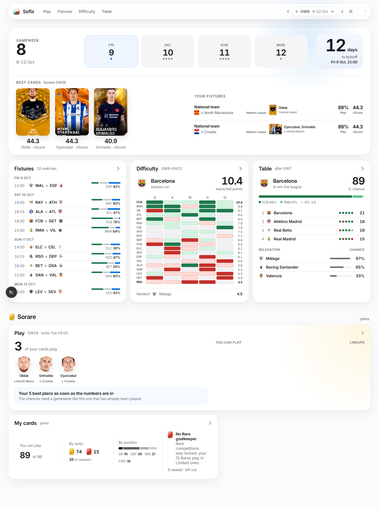

The top strip shows the selected LaLiga gameweek, its playing days and time to the next kickoff. **Best cards** uses
one fixed Sorare-card ratio and shows xScore. **Your fixtures** names the side actually playing—club or national
team—and the owned players/cards in that match. A rated LaLiga row shows Win and Clean sheet; an outside-LaLiga row
shows the best owned player's clearly labelled **Play** percentage and xScore because Sofix has no match odds for it.
Under the strip:

- **Fixtures** groups all matches by Madrid date/time and shows the market/model win split.
- **Difficulty** previews the selected multi-week run and expected points ranking.
- **Table** shows the current leader and seeded title/relegation probabilities.
- **Your Sorare lineups** is the first block in the Sorare section. It reads the signed-in owner's entered lineups
  and drafts for the selected Sorare GW, with competition, lineup name and card art. It is read-only.
- **Play** summarizes the published Sorare plan, estimated chance of any reward, expected essence/cash and time to lock.
- **Last gameweek** compares pre-lock predictions with the owner's submitted-lineup actuals when scores exist.
- **My cards** shows usable cards, rarity/position shape and the most important constraint.

Every large card is a link to the detailed page. A missing data block should say why—no fixtures, waiting for Sorare,
stale data or a failed connection—rather than silently substituting another week.

When a selected Sorare week has no LaLiga round, Home replaces the LaLiga strip/tiles with **No LaLiga this week**
and lists the owner's actual fixtures, chance to play and xScore. It does not silently show the next league round.

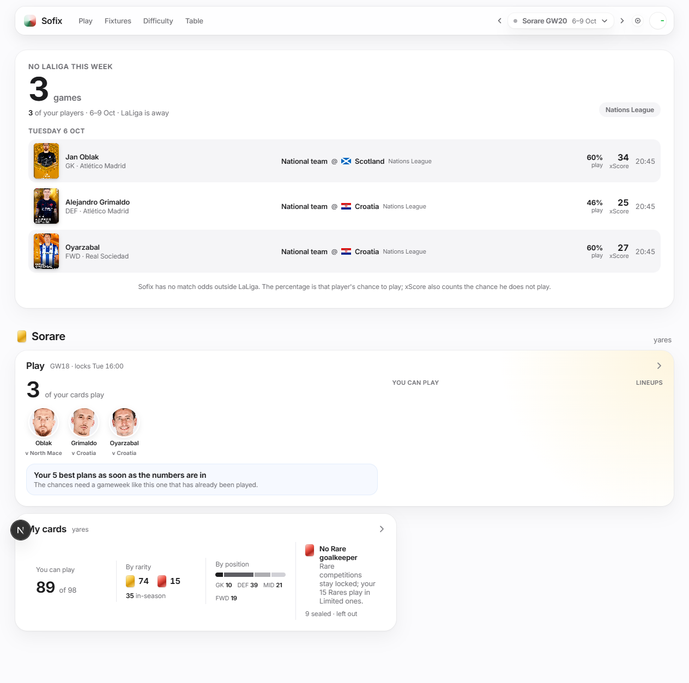

## 3. Fixtures

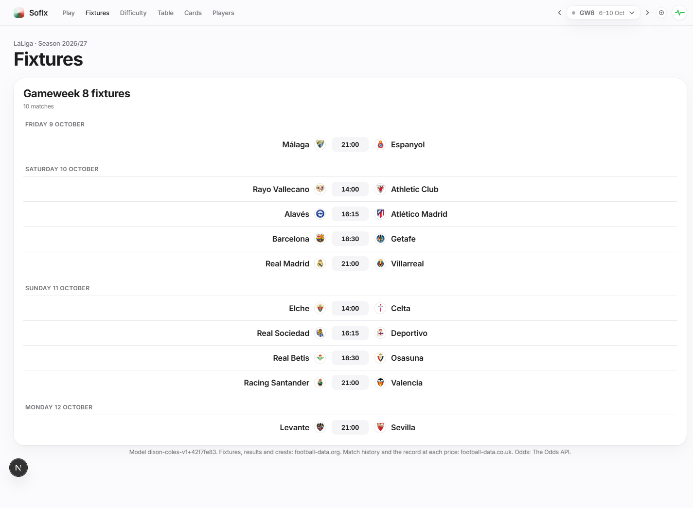

Fixtures is the plain schedule for the selected LaLiga GW. Each row contains kickoff in `Europe/Madrid`, home/away
clubs, status or score, and the pre-match outlook. “Date TBC” means football-data.org has not assigned a kickoff.

For a future match, use the probability/price context as a forecast, not as a certainty. For a finished match, the
stored forecast stays attached so the result can be reviewed honestly. Changing the header week changes this list,
the difficulty overview and the current-table cutoff together.

## 4. Difficulty

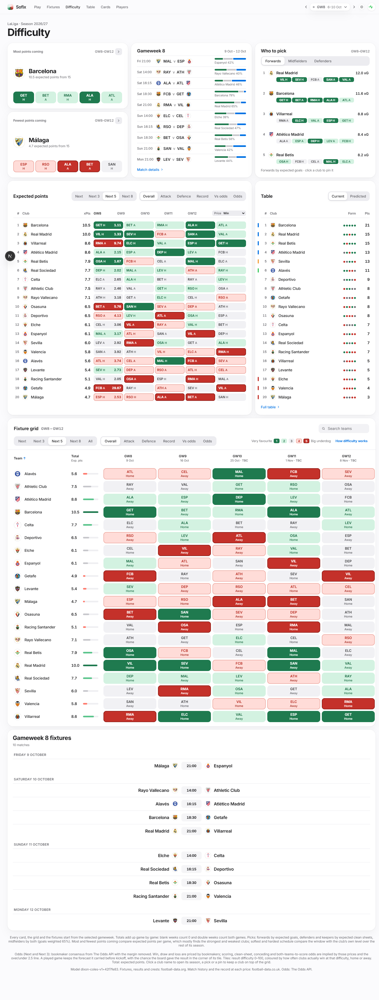

Difficulty is the main football-planning page. It contains:

1. **Kindest/toughest run** — per-game comparison for the chosen horizon.
2. **This GW** — the selected matches.
3. **Who to pick** — forwards by expected goals, defenders/keepers by clean-sheet chance, midfielders by a 65/35
   attack/defence blend.
4. **All-club ranking beside the current table** — row-aligned, with xPts as a number rather than a decorative bar.
5. **Full fixture grid** and the selected GW's fixture list.

### Horizon

**Next** shows the selected gameweek as match cards. **Next 3/5/8** aggregates future games from that week. Finished
fixtures remain visible for review but do not inflate future totals.

### Six lenses

| Lens | Tile answers | Ranking total answers |
|---|---|---|
| Overall | How likely is the club to get a result? | Expected points across future games |
| Attack | How many goals should it score? | Expected goals across future games |
| Defence | How likely is a clean sheet? | Expected clean sheets across future games |
| Record | How has this club historically done at this model price? | Average actual points in comparable price bands |
| Vs odds | How has it historically done at this bookmaker price? | Average actual points in comparable market bands |
| Odds | What is the fair bookmaker win chance? | Market expected points per priced future game |

Record and Vs odds are descriptive checks, not hidden inputs to the forecast. They use five seasons, require at least
five club matches and shrink toward an eight-game prior. Odds totals are averaged per priced future match so a club
with an extra priced game is not automatically favoured.

### Colours and labels

Lower difficulty is kinder. The five spoken labels are **Very favourite**, **Favourite**, **Even**, **Underdog** and
**Big underdog**. Tiles show colour, opponent and venue; bucket numbers deliberately stay in tooltips/screen-reader
text. Buckets 4–5 also receive a visible ring. The top cutoff is stricter away than at home.

### Price menu

For multi-week Record/Vs odds cards, choose which price/result statistic appears: W/D/L, scoring/two-plus goals,
clean sheet or conceding two-plus. Fair odds are `1 / probability`. Market-derived scoring and clean-sheet numbers
are fitted from fair 1X2 plus totals prices; they are implied probabilities, not direct bookmaker markets.

## 5. Table

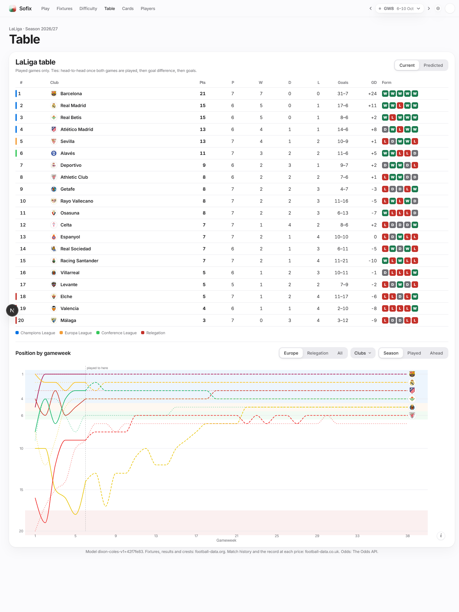

The left/current table stops after the selected LaLiga GW. Its ordering applies LaLiga head-to-head only after both
mutual matches have been played, then goal difference and goals scored. Early in a season, that can differ from a
site that provisionally uses goal difference for unresolved ties.

The predicted table combines played points with expected future points and seeded season simulations. Identical
input always produces identical title/Europe/relegation percentages. It is a model projection, not the official
table and not a live betting price. The preseason opening projection is fixed so later views do not rewrite what
Sofix believed before the season.

## 6. Team page

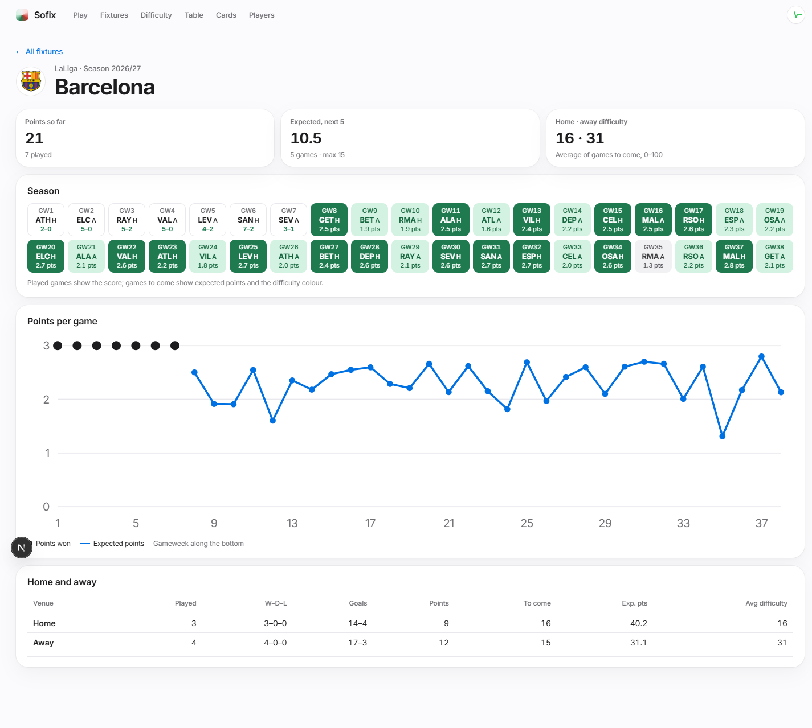

Open a club from a table, fixture or grid. The team page gathers its selected-week match, upcoming run, lens values,
results/form and table context. Use it when the grid's compact tile is not enough. The same global week and model
definitions apply; the page does not run a separate club model.

## 7. Play — Sorare planner

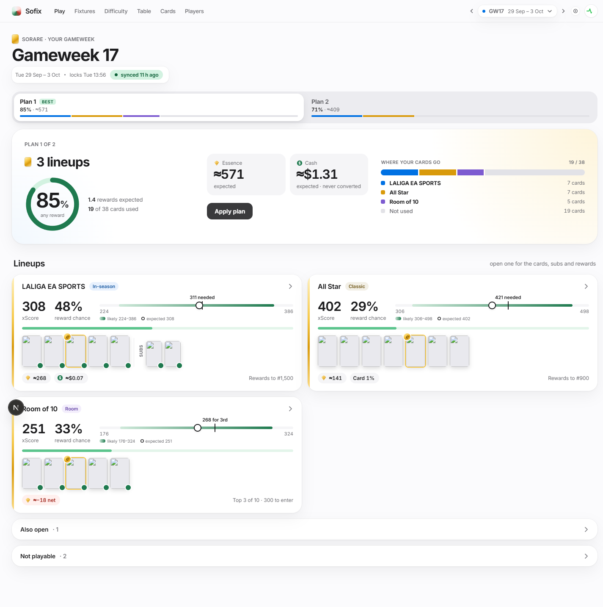

Play shows the latest published plan for the selected Sorare gameweek. It is built from the synced collection,
competition rules, pre-lock forecasts and reward cutoffs.

At the top, **Your Sorare lineups** shows what the signed-in owner actually put on Sorare for this exact GW. Entered
lineups and drafts are labelled separately and retain their Sorare competition and card list. This is not Sofix's
suggested plan: the extension reads the selected Sorare fixture directly, so the block also works for timeline weeks
that Sofix no longer retains as an optimized plan. A signed-in `sorare.com` tab must be open; otherwise the block says
which extension/session prerequisite is missing. Lineups from another GW are never carried into the selected one.

Once Sorare has scored a lineup, its row shows the **score** (large), then **where it ranked and what it was paid**
("Rank 1,204 · $2.50 · 250 essence", or "no reward paid" once it is ranked and nothing was), and each card carries its
own score with a **C** on the captain. While the games are still being played it says "Still scoring". This needs the
extension at version 0.2.2 or later (reload it in `chrome://extensions`); an older one still shows the lineups, without
their results. Essence counts Limited essence only, as the plans do.

Read each lineup from left to right:

- competition and lock state;
- cards/slots, captain and substitutes;
- **xScore**, which includes the chance of not playing;
- an expected range, not a guarantee;
- reward probability and the cutoff evidence behind it;
- expected essence and expected cash, kept as separate units.

The planner enforces the published slots, caps, in-season minimum, club/card/player uniqueness, bonuses and substitute
rules. A substitute is kept only when its expected protection exceeds the bonus sacrificed by using it. It repeats a
seeded, slightly randomized whole-gameweek search and returns up to five plans whose card sets are materially different;
cash and essence are normalized for ranking but remain separate in the UI.

### xScore

`xScore = P(plays) × score if playing`. The “if playing” score usually comes from Sorare's projection; starting/sub
odds supply P(plays) when published. Before those exist, last-five form plus conservative priors is used. The source
and freshness label matters: “form” is weaker evidence than a recorded Sorare-informed pre-lock forecast.

### Predicted vs actual

After a gameweek, Play compares recorded pre-lock player/lineup ranges with actual submitted-lineup scores. A replay
is meaningful only when the forecast was stored before lock. Actuals do not retroactively change the old forecast.

Choose **After the games** on a played week: each plan shows what it won against what it was expected to win (the
expected numbers are a replay, built from form as it stood before the lock, not the Sorare-informed plan you saw then).
The last tab, **In hindsight**, is the best way to have spread your cards over that week's competitions knowing every
score: the most it could have won, against the scores that really paid that week. It uses the cards you own today, leaves
Rooms out (a Room depends on nine other managers' lineups), and never names an expected number, because there is none.

A LaLiga round Sorare has not opened yet (LaLiga GW36 in May, say) opens as an **early plan**: a plain note says so,
and it is built from the LaLiga calendar for your cards' games, their recent form and the competitions of the gameweek
being planned, with one plan and no Apply button. It is a first guess: your cards as they are today, no start odds, and
competitions Sorare may change. It moves each refresh, and Sorare's own numbers replace it when the week opens.

Every gameweek is **kept** once its scores are final (a day after it ends) and stays in the picker with its replay
and hindsight, however old. A week played before Sofix started keeping them is marked **not recorded**; it still opens,
to the lineups you entered and what they won, read from Sorare.

## 8. Apply a lineup

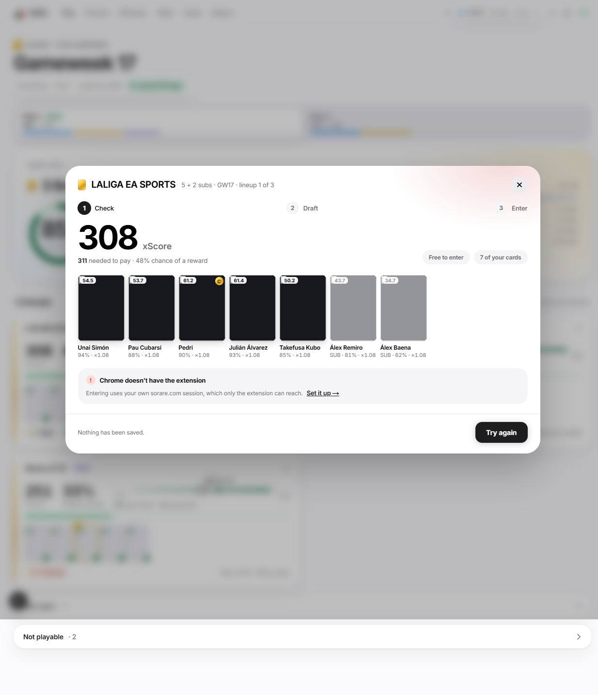

Apply is the only Sofix flow that can change Sorare. It requires the configured extension, a signed-in Sorare tab,
the matching Sorare account and an unlocked/non-stale plan.

1. **Open Apply.** Sofix reads already-entered lineups and available slots; this is read-only.
2. **Check.** Sorare previews the appearances and returns its rule verdict, bonuses, multiplier, costs and errors.
   Nothing is saved.
3. **Save draft.** Sorare creates or updates a draft. The lineup is not yet entered.
4. **Enter.** A separate explicit confirmation calls Sorare's confirm operation. This can consume a slot or fee.

Never treat Check or Draft as proof of entry. Read Sorare's returned feedback. If Sofix and Sorare disagree, stop:
the server's rule verdict wins and the mismatch is a bug to investigate. Sofix never schedules or auto-retries Enter.

## 9. My cards

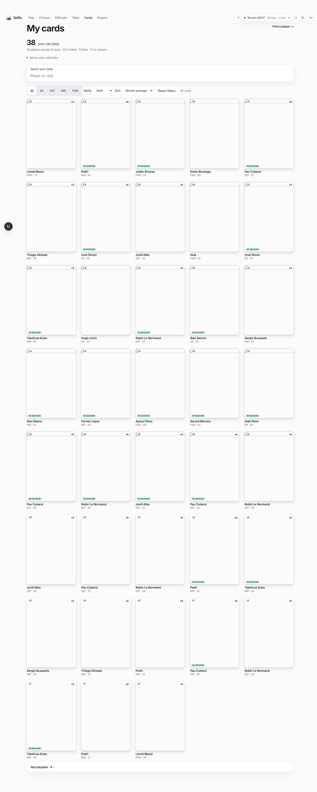

Cards is the latest synced collection snapshot, not a historical collection at the selected week. It distinguishes:

- usable cards from sealed/for-sale/in-offer/otherwise excluded cards;
- physical cards from distinct players, because duplicates do not create another usable player in one lineup;
- position and rarity balance;
- L5/L10/L40 form, play share and gameplay tier when supplied.

Search by player or club, filter position/rarity and change sort; those choices are URL state and can be bookmarked.
Excluded cards are folded rather than deleted so the reason remains inspectable.

## 10. Players

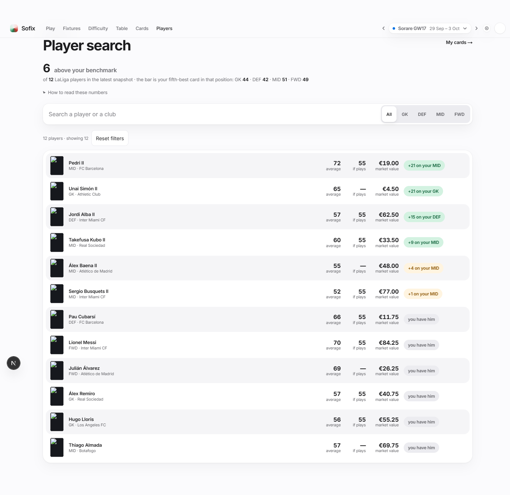

Players is a cached index built from LaLiga club squads during refresh—one competition query plus one query per club.
Search is local and fast; it does not make a Sorare request per keystroke.

Each result shows recent average, Sorare projection **if he plays**, cached Limited market value, and the improvement
against the fifth-best owned card in the same position. “You have him” prevents an owned player being presented as
a new signing. The price is Sorare's last-synced market valuation, not the lowest current listing and not an offer
Sofix can execute.

If the index is empty, the page should show a sync/schema/key state. It must not broaden silently to other leagues.

## 11. Control Center

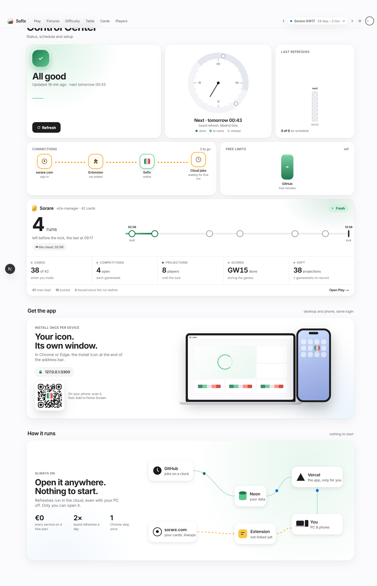

Control is the operational truth for the owner:

- **All good / failure state** and last-update age;
- manual **Refresh**, which dispatches the same GitHub workflow as the schedule;
- next scheduled runs and recent run history;
- connection chain: Sorare sign-in → extension → Sofix → cloud jobs;
- remaining Odds API credits and Neon storage where available;
- Sorare sync freshness and forecast/replay counts;
- PWA installation and QR;
- extension and GitHub setup instructions when a piece is missing;
- a diagram of the always-on cloud path.

The scheduled times are 07:17 and 22:43 UTC daily, plus Tuesday 13:23 and Friday 17:23 UTC. The UI converts them to
Madrid time, so the local hour moves at daylight-saving changes. Manual refresh has a ten-minute cooldown and cannot
run alongside another refresh. It does not apply migrations.

If GitHub/extension setup is missing, Control gives the required owner step. Never paste a token into chat, an issue
or a committed file.

## 12. Chrome extension

### Install or rebuild

The extension is a local Manifest V3 build, not a store listing.

1. In root `.env`, set `APP_URL`, a random `EXTENSION_TOKEN` of at least 32 bytes, and
   `VERCEL_BYPASS_SECRET`.
2. Run `node extension/scripts/configure.mjs` from the repository root.
3. Open `chrome://extensions`, enable **Developer mode**, choose **Load unpacked**, and select `extension/`. If Sofix
   was already loaded, press its circular-arrow **Reload** button instead; a changed file on disk does not update the
   running Chrome extension by itself. Reload the already-open `sorare.com` tab too, because its page bridge was
   injected by the previous extension build.
4. In that same Chrome profile, open Sofix and a signed-in `sorare.com` tab, then check Control. The popup can
   disable/enable the overlay. Codex's in-app browser and other browsers cannot call a Chrome extension.

`manifest.json` and `config.js` are generated and git-ignored because the latter holds secrets. Re-run configure and
reload the extension after changing the app origin or token.

### Cards on sorare.com

On Sorare's football pages Sofix draws a small dark-glass **tile** inside the top-left corner of each card it can name.
The big number is the score he is expected to score **if he starts** (a small shirt marks it), painted in Sorare's own
colour for that score. Under it is one thing that drives the score, chosen by position:

- **Goalkeepers and defenders: FDR**, Sofix's difficulty of his game (0 to 100), in Sorare's five colours from cyan
  (very favourite) to red (big underdog). It is the same number as the difficulty page.
- **Midfielders and forwards: xG**, his expected goals if he starts: his season's rate from Understat, scaled to how many
  goals his side is expected to score in that game. It is there for players Understat can name in the Premier League, La
  Liga, Bundesliga, Serie A, Ligue 1 and the Russian league who have played at least a full game. Anyone else, and any
  player at a club in another league, shows **No xG** where the xG would be, rather than a made-up number. (A goalkeeper
  or defender whose game is not priced shows **No odds**, since his line is the game's difficulty.)

On the compose page, directly under Sorare's own win / draw / loss bar, Sofix adds a row: **its win % and its clean
sheet %** for that game. For a LaLiga game they are Sofix's own model; for any other league or a national team they come
from Sorare's odds for the game. Sorare fills those odds only in the last few days before a game, so a card whose game is
not priced shows the tile and no row. Sorare's bar is found by what it says (three percentages) and where it is, up to
about half a card's height under the picture: on a list of cards it is the third row of the block under each card. To make
room, Sofix moves Sorare's next line ("Best score chosen", the kickoff) down a few pixels; if that line cannot be moved, the
row is not drawn.

**Hover the tile, or focus it with the keyboard**, and a panel opens beside the card. A switch shows the score if he
**starts** (the default) or if he **doesn't start**, with his chance of each (the chance he comes on is worth little for a
goalkeeper: "2% he comes on"). Under it: difficulty with its five bands and the clean-sheet chance for a goalkeeper or
defender, xG and the clean-sheet chance for a midfielder, xG and the win chance for a forward, where the odds came from,
and how long ago the numbers were made. Escape closes it. It only shows things; nothing in it writes to Sorare.

- **His chance of starting** is the bottom row of every full tile ("90%"): Sorare's own odds where it has them, the app's
  chance where it has not. It is quiet while he probably starts; **below 50% the row is red**, which is the warning. A tile
  greyed as "Started" or "Old" has none, and a small lineup tile has no room for it.
- **Loading** shows a shimmer; a **small card** (a lineup slot) gets the number alone, a **thumbnail** an even smaller one,
  and a picture under 48 px wide gets nothing.
- **Signed out or app unreachable:** a very small **SIGN IN** or **OFFLINE** tag, the only thing here that takes a click
  apart from the tile; it opens Sofix.

**Decisions.** Sofix's best plan for the gameweek marks the cards it would use: a white **tick** on the tile's corner for a
card in the plan and a gold **star** for its captain. Only the copy the plan uses is marked (your other copy of the same player
stays plain), and a card the plan leaves out shows nothing, never a warning. Which lineup it is in is in the panel ("In your
best plan · All Star · Captain"). On a **"Select your ..." list of four or more cards**, the three with the best expected score
get **#1, #2, #3**, worked out from the cards on screen, so on a long list they can change as you scroll; there is no rank on a
page without that heading. When his game has started, or the numbers are more than a day old, the tile loses its colour and its
last line says **Started** or **Old**, instead of showing a confident number that no longer holds.

The tile takes about 5% of a card and none of its face. It starts below any chip of Sorare's own on that corner, never
touches the ones on the right (their percentage, the captain button, the lock timer, "Best value"), and a press on the
card anywhere except the tile still selects the card. Tiles appear for the players you own who have a game in the
gameweek; a card Sofix has nothing on gets nothing. Cards are found by the address of their picture, not by Sorare's
generated CSS class names.

### Plan drawer

The **Sofix** tab on the right edge of Sorare's football pages opens your gameweek: what the best plan adds up to,
the cards of its leading lineup, the reward chance, the essence expected and how many of your cards it uses.
**Open Apply in Sofix** opens the Play page for that gameweek and returns you to the controlled three-step flow;
lineup write buttons are intentionally not placed over Sorare's browsing UI. The tab is hidden on narrow windows.

### Which gameweek a page is about

When the address of a Sorare page names a gameweek (Sorare names them by their dates, "football-25-29-sep-2026"), the tiles
are that gameweek's numbers and not this week's. A gameweek Sofix kept shows its numbers as they stood when it ended (grey,
"Started"); one it did not keep shows **no tiles at all** rather than this week's numbers under its name. A page whose
address names no gameweek shows the gameweek being planned, as before. The popup's **Gameweek in the address** row says
what the last page named ("25 29 sep 2026", or "none named"), which is how to tell whether a page carries one. The tiles follow
the page when Sorare moves to another gameweek without reloading, and back.

### The switch

The popup's **Scores on sorare.com** switch turns the tiles, the odds row and the tab on and off at once, with no
reload; switching off gives back the room made under Sorare's odds bar. (The old **Show chance of playing** switch is
gone: his chance of starting is now on every tile and in the panel.)
**Cards recognised here** shows how many cards on the page you are looking at Sofix could name ("7 of 7"). "0 of 8"
means Sorare has changed how it draws cards and the overlay needs an update. The larger "Sofix panel" on a player
page in the design preview (`S7-player-page.html`) is not built.

### Privacy and account matching

The extension captures the last Sorare GraphQL endpoint/headers in page memory only so allowlisted operations can
use the existing signed-in session. One read-only operation fetches all of the owner's lineups for the selected
Sorare fixture; Apply's separate competition-level read still checks capacity before a write. The extension never
sends the cookie/password to Sofix and exposes no general proxy. Check-in
sends only public username, version and Sorare build/revision. Which cards a page shows is sent only to your own Sofix
app, as card and player slugs, and only with the extension's secret token; answers are kept in the browser's memory
for 15 minutes. Matching the signed-in Sorare account to the Sofix owner is not enforced yet: the numbers go only to
the extension that holds the token.

## 13. Reading freshness and errors

| Message/state | Meaning | Action |
|---|---|---|
| Fresh / up to date | Latest publish is within its expected window | None |
| Waiting for projections | Sorare has not published the strong pre-lock inputs | Use form-only plan cautiously or wait |
| No odds yet | Optional odds step skipped/too old/no match | Use model lenses; do not interpret Odds as zero |
| This browser can't reach the extension | Sofix is open outside the Chrome profile that loaded it | Open Sofix in that Chrome profile; keep Sorare signed in there |
| Reload the Sofix extension | Chrome is running an older local build (lineup reads require v0.1.1+) | In `chrome://extensions`, press **Reload** on Sofix; reload the Sorare tab, then the app |
| Sorare tab missing / signed out | Actual lineups and Apply bridge are unavailable | Open Sorare in the same Chrome profile, sign in, then retry |
| Database paused | Neon free monthly compute limit was exhausted | Wait for monthly reset; avoid repeated DB monitors |
| Refresh failed at a step | Source/schema/job error; older payload may still be visible | Inspect Control/GitHub run before trusting freshness |
| Date TBC | Kickoff unassigned | Do not infer midnight or local date |

## 14. What Sofix cannot promise

- Match probabilities, player availability, scores and rewards remain uncertain.
- Sorare xScore is currently a documented heuristic awaiting enough blind replay data for a fitted replacement.
- Reward simulations use a common measured score spread and simplify cross-player/lineup correlation.
- A market value is not a tradable quote.
- Sorare can change rules or its page/API; the Check response is authoritative before any draft/entry.
- The app is personal/non-commercial and its third-party imagery/marks remain owned by their respective holders.

Known calendar limitation at this edition: every Sorare gameweek of the season is in Play's picker, but Sofix only has
the plans, replay and best lineups in hindsight of the weeks it has kept, which starts with the first one played after
this feature went live. Any earlier week is marked **not recorded** and opens to your entered lineups with their
results, read from Sorare, under a note that Sofix didn't keep its plans. Rebuilding those earlier weeks from Sorare's
history, with the cards you own today, is written down in TODO.md.

For the evidence and exact technical debt, continue to [the research report](research_report.md).
